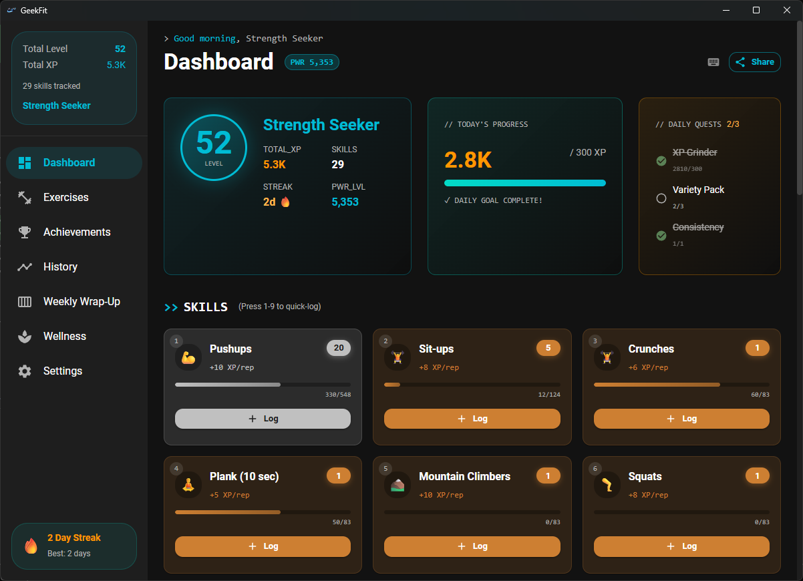
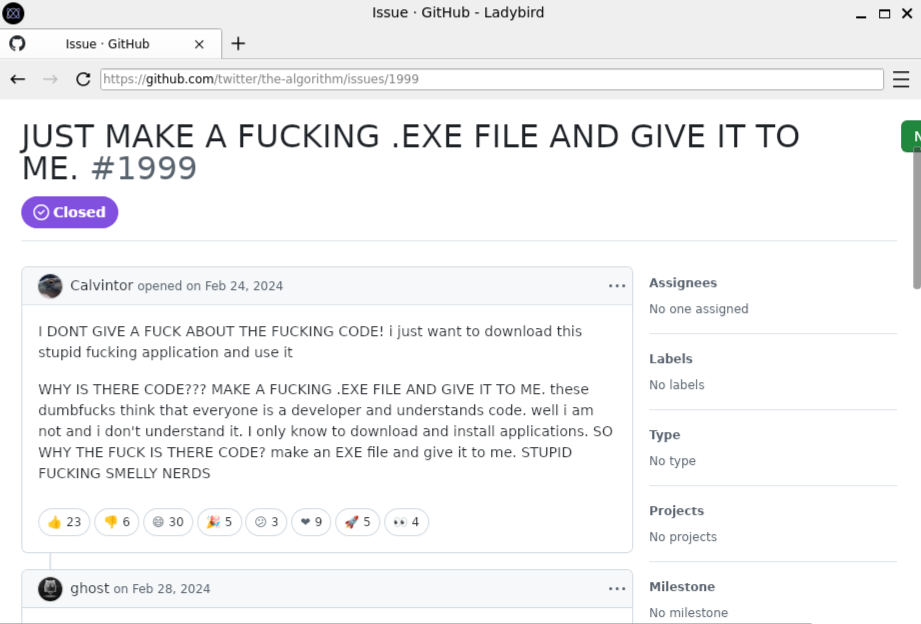
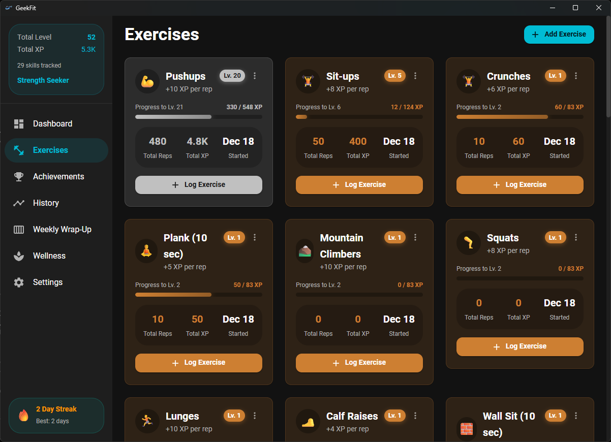
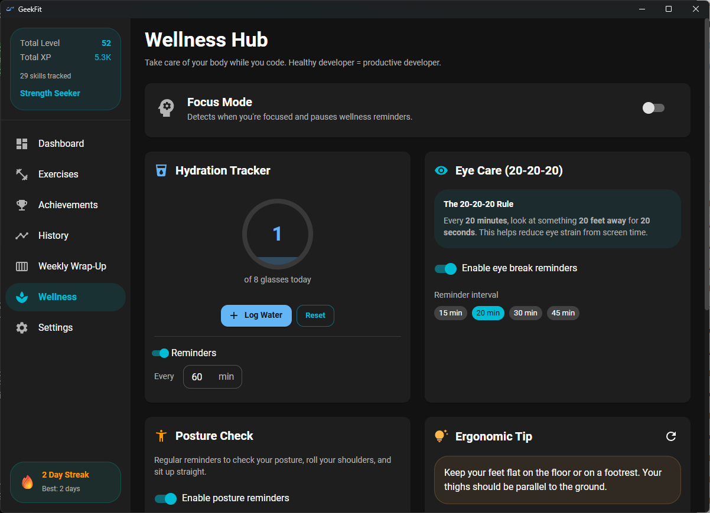
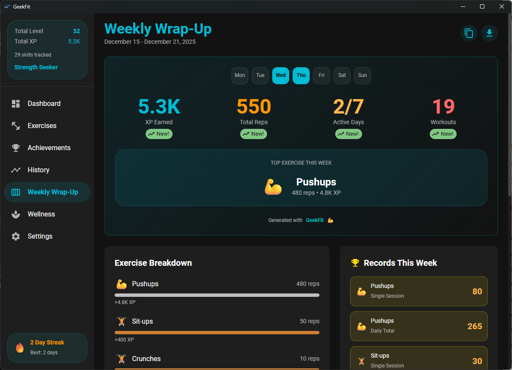
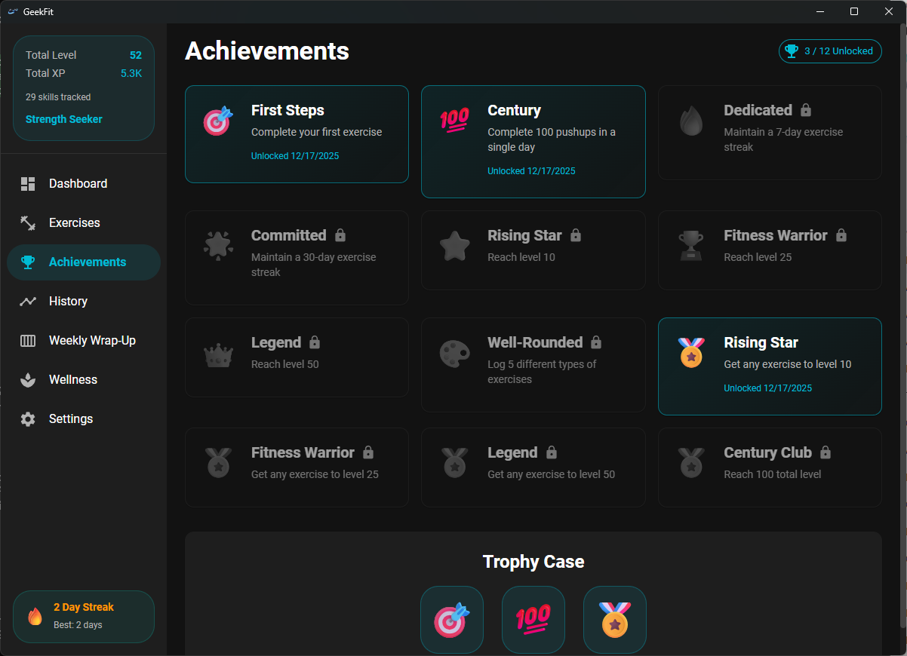

# GeekFit

[](https://github.com/mvogttech/geekfit/actions/workflows/ci.yml)
[](https://github.com/mvogttech/geekfit/actions/workflows/codeql.yml)
[](https://github.com/mvogttech/geekfit/actions/workflows/security.yml)
[](https://opensource.org/licenses/MIT)

A gamified fitness tracker designed for programmers who spend long hours at their desks. Level up your exercises, earn XP, unlock achievements, and maintain healthy habits - all with a beautiful desktop app that respects your workflow.



## Features

### Core Fitness Tracking

- **Exercise Logging** - Track 25+ desk-friendly exercises (pushups, squats, stretches, etc.)
- **XP System** - RuneScape-inspired exponential leveling (1-99 per exercise)
- **Streak Tracking** - Build daily exercise streaks with visual feedback
- **Quick Log** - Global hotkey `Ctrl+Shift+Alt+G` to log exercises without breaking flow

### Gamification

- **Per-Exercise Levels** - Each exercise has its own level (1-99)
- **Total Level** - Combined level across all exercises
- **Achievements** - Unlock badges for milestones (7-day streak, Level 50, etc.)
- **Collectible Badges** - 30+ badges with 5 rarity tiers (Common to Legendary)
- **Titles** - Earn titles like "Novice Geek" to "Legendary Geek"

### Wellness Hub

- **Eye Care (20-20-20 Rule)** - Reminders to look away from screen
- **Hydration Tracking** - Log water intake with daily goals
- **Posture Reminders** - Periodic posture check notifications
- **Ergonomic Tips** - Rotating tips for desk ergonomics
- **Focus Mode Detection** - Auto-pause notifications during deep work

### Developer Experience

- **10 Developer Themes** - Dracula, Nord, Monokai, Solarized, GitHub Dark, One Dark, Catppuccin, and more
- **Keyboard-First Navigation** - `Ctrl+1-6` for pages, `Ctrl+/` for shortcuts
- **CLI Tool** - Log exercises from terminal: `geekfit-cli log pushups 20`
- **GitHub-Style Contribution Graph** - Visualize your exercise activity
- **Shareable Fitness Commit Cards** - Git-style commit messages for social sharing

### Additional Features

- **System Tray** - Runs in background, double-click to open
- **Desktop Notifications** - Customizable reminder intervals
- **Data Export/Import** - Full JSON backup and restore
- **Localization** - English and Spanish (more coming)
- **Onboarding Tutorial** - Guided introduction for new users
- **Sound Effects** - Satisfying audio feedback (optional)

## Installation

### Give me the .exe/.dmg!

| Platform | Download |
|----------|----------|
| Windows | [GeekFit_x64-setup.exe](https://github.com/mvogttech/geekfit/releases/latest) |
| macOS (Intel) | [GeekFit_x64.dmg](https://github.com/mvogttech/geekfit/releases/latest) |
| macOS (Apple Silicon) | [GeekFit_aarch64.dmg](https://github.com/mvogttech/geekfit/releases/latest) |
| Linux (AppImage) | [GeekFit_amd64.AppImage](https://github.com/mvogttech/geekfit/releases/latest) |
| Linux (deb) | [GeekFit_amd64.deb](https://github.com/mvogttech/geekfit/releases/latest) |

Or browse all assets on the [Releases page](https://github.com/mvogttech/geekfit/releases).



### Prerequisites

- [Node.js](https://nodejs.org/) (v18+)
- [Rust](https://rustup.rs/) (latest stable)

### Development Setup

```bash
# Clone the repository
git clone https://github.com/mvogttech/geekfit.git
cd geekfit

# Install dependencies
npm install

# Run in development mode
npm run tauri dev
```

### Build for Production

```bash
# Build the app
npm run tauri build
```

The installer will be in `src-tauri/target/release/bundle/`.

## Screenshots








## CLI Tool

For terminal lovers, GeekFit includes a CLI:

```bash
# Build the CLI
cd src-tauri
cargo build --release --bin geekfit-cli

# Add to PATH (the binary is in target/release/)
```

### CLI Commands

```bash
geekfit-cli log pushups 20    # Log 20 pushups
geekfit-cli stats             # Show your stats
geekfit-cli list              # List all exercises with levels
geekfit-cli today             # Show today's progress
geekfit-cli history -d 7      # Show last 7 days
geekfit-cli achievements      # Show achievements
geekfit-cli quick push        # Fuzzy search exercises
```

## Keyboard Shortcuts

| Shortcut           | Action                                   |
| ------------------ | ---------------------------------------- |
| `Ctrl+Shift+Alt+G` | Quick Log (global, works when minimized) |
| `Ctrl+1`           | Dashboard                                |
| `Ctrl+2`           | Exercises                                |
| `Ctrl+3`           | Achievements                             |
| `Ctrl+4`           | History                                  |
| `Ctrl+5`           | Weekly Wrap-Up                           |
| `Ctrl+6`           | Wellness                                 |
| `Ctrl+,`           | Settings                                 |
| `Ctrl+/`           | Show all shortcuts                       |

## Tech Stack

- **Frontend**: React 19, TypeScript, Material UI 7
- **Backend**: Tauri v2, Rust
- **Database**: SQLite (via rusqlite)
- **Build**: Vite 7

## Project Structure

```
geekfit/
├── src/                    # React frontend
│   ├── components/         # UI components
│   ├── contexts/           # React contexts (User, Theme, Wellness, Locale)
│   ├── hooks/              # Custom hooks
│   ├── pages/              # Page components
│   ├── themes/             # Theme definitions
│   ├── i18n/               # Translations
│   └── utils/              # Utilities (XP calc, sounds)
├── src-tauri/              # Rust backend
│   ├── src/
│   │   ├── lib.rs          # Tauri commands & DB logic
│   │   ├── main.rs         # App entry point
│   │   └── bin/cli.rs      # CLI binary
│   ├── icons/              # App icons
│   └── Cargo.toml
└── package.json
```

## XP System

GeekFit uses a RuneScape-inspired exponential XP curve:

```
Level 1:  0 XP
Level 10: 1,154 XP
Level 25: 8,740 XP
Level 50: 101,333 XP
Level 99: 13,034,431 XP
```

Each exercise levels independently, and your total level is the sum of all exercise levels.

## Themes

Choose from 10 developer-favorite themes:

| Theme           | Colors             |
| --------------- | ------------------ |
| GeekFit Dark    | Cyan/Teal on dark  |
| GeekFit Light   | Cyan/Teal on light |
| Dracula         | Purple/Pink/Green  |
| Nord            | Blue/Frost         |
| Monokai         | Yellow/Pink/Green  |
| Solarized Dark  | Blue/Orange        |
| Solarized Light | Blue/Orange        |
| GitHub Dark     | Blue/Green         |
| One Dark        | Blue/Purple        |
| Catppuccin      | Mauve/Pink         |

## Contributing

Contributions are welcome! See [CONTRIBUTING.md](CONTRIBUTING.md) for guidelines.

Areas where help is needed:

- **Translations** - Add your language to `src/i18n/index.ts`
- **Themes** - Create new themes in `src/themes/index.ts`
- **Exercises** - Suggest desk-friendly exercises
- **Badges** - Design new achievement badges
- **Tests** - Improve test coverage

### Quick Start for Contributors

```bash
# Run tests
cd src-tauri && cargo test

# Check TypeScript
npx tsc --noEmit

# Check formatting
cargo fmt -- --check
cargo clippy -- -D warnings
```

## License

MIT License - see [LICENSE](LICENSE) for details.

## Acknowledgments

- Inspired by [RuneScape](https://www.runescape.com/) XP system
- Theme colors from [Dracula](https://draculatheme.com/), [Nord](https://www.nordtheme.com/), [Catppuccin](https://catppuccin.com/)
- Built with [Tauri](https://tauri.app/) and [Material UI](https://mui.com/)

---

**Stay fit, keep coding!**
